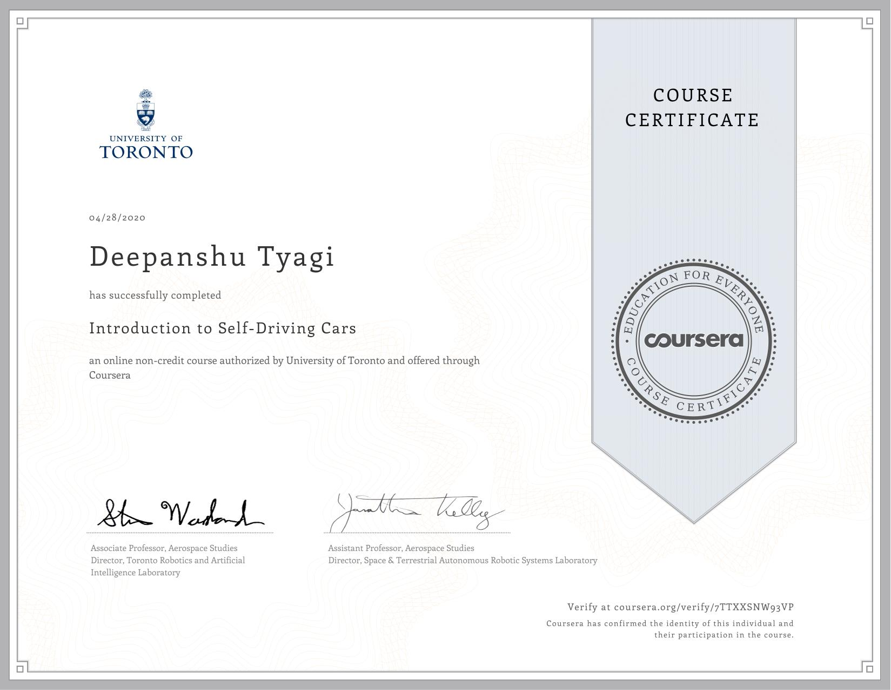

# Introduction to Self-Driving Cars

This course will introduce you to the terminology, design considerations and safety assessment of self-driving cars. By the end of this course, you will be able to: - Understand commonly used hardware used for self-driving cars - Identify the main components of the self-driving software stack - Program vehicle modeling and control - Analyze the safety frameworks and current industry practices for vehicle development For the final project in this course, you will develop control code to navigate a self-driving car around a racetrack in the CARLA simulation environment. You will construct longitudinal and lateral dynamic models for a vehicle and create controllers that regulate speed and path tracking performance using Python. You’ll test the limits of your control design and learn the challenges inherent in driving at the limit of vehicle performance. This is an advanced course, intended for learners with a background in mechanical engineering, computer and electrical engineering, or robotics.

## Content

Quiz and assignment solutions arranged by weeks.

### [Week 1](./Week_1)

### [Week 2](./Week_2)

### [Week 3](./Week_3)

### [Week 4](./Week_4)

### [Week 5](./Week_5)

### [Week 6](./Week_6)

### [Week 7](./Week_7)