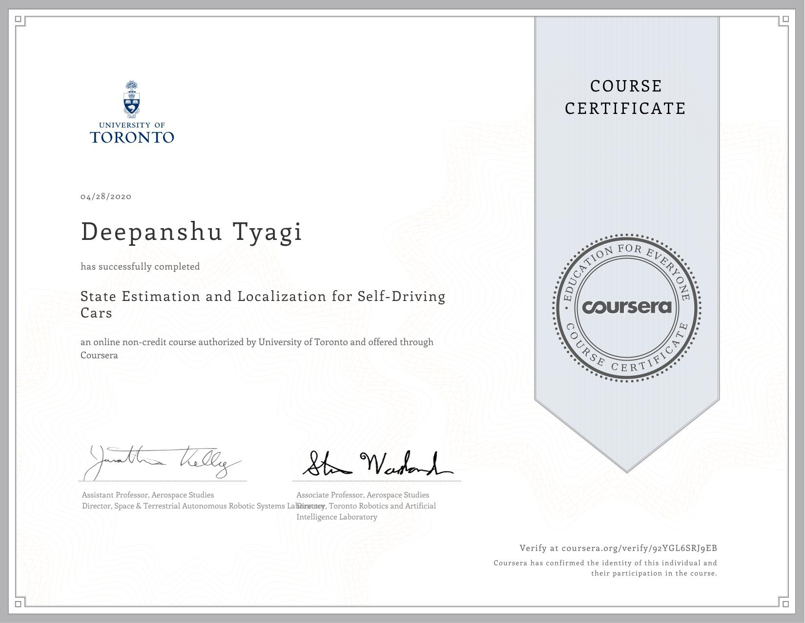

# State Estimation and Localization for Self-Driving Cars

This course will introduce you to the different sensors and how we can use them for state estimation and localization in a self-driving car. By the end of this course, you will be able to: - Understand the key methods for parameter and state estimation used for autonomous driving, such as the method of least-squares - Develop a model for typical vehicle localization sensors, including GPS and IMUs - Apply extended and unscented Kalman Filters to a vehicle state estimation problem - Understand LIDAR scan matching and the Iterative Closest Point algorithm - Apply these tools to fuse multiple sensor streams into a single state estimate for a self-driving car For the final project in this course, you will implement the Error-State Extended Kalman Filter (ES-EKF) to localize a vehicle using data from the CARLA simulator.

## Content

Quiz and assignment solutions arranged by weeks.

### [Week 1](./Week_1)

### [Week 2](./Week_2)

### [Week 3](./Week_3)

### [Week 4](./Week_4)

### [Week 5](./Week_5)