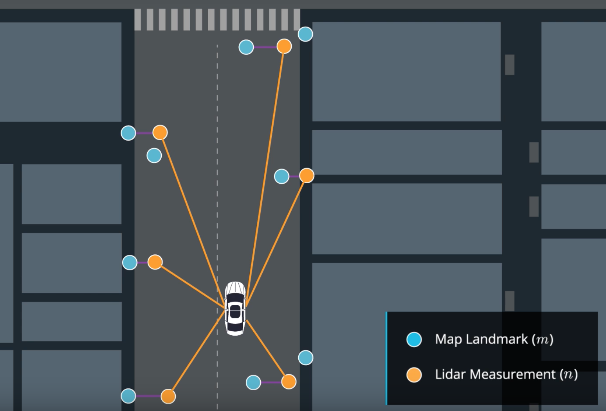

# State Estimation and Localization for Self-Driving Cars

This course will introduce you to the different sensors and how we can use them for state estimation and localization in a self-driving car. By the end of this course, you will be able to: - Understand the key methods for parameter and state estimation used for autonomous driving, such as the method of least-squares - Develop a model for typical vehicle localization sensors, including GPS and IMUs - Apply extended and unscented Kalman Filters to a vehicle state estimation problem - Understand LIDAR scan matching and the Iterative Closest Point algorithm - Apply these tools to fuse multiple sensor streams into a single state estimate for a self-driving car For the final project in this course, you will implement the Error-State Extended Kalman Filter (ES-EKF) to localize a vehicle using data from the CARLA simulator.

## Week 1: Least Squares

The method of least squares, developed by Carl Friedrich Gauss in 1795, is a well known technique for estimating parameter values from data. This module provides a review of least squares, for the cases of unweighted and weighted observations. There is a deep connection between least squares and maximum likelihood estimators (when the observations are considered to be Gaussian random variables) and this connection is established and explained. Finally, the module develops a technique to transform the traditional 'batch' least squares estimator to a recursive form, suitable for online, real-time estimation applications.

- Module 1: [Graded Quiz](./Week_1/Module_1_Graded_Quiz.pdf)

## Week 2: Linear and Nonlinear Kalman Filters

Any engineer working on autonomous vehicles must understand the Kalman filter, first described in a paper by Rudolf Kalman in 1960. The filter has been recognized as one of the top 10 algorithms of the 20th century, is implemented in software that runs on your smartphone and on modern jet aircraft, and was crucial to enabling the Apollo spacecraft to reach the moon. This module derives the Kalman filter equations from a least squares perspective, for linear systems. The module also examines why the Kalman filter is the best linear unbiased estimator (that is, it is optimal in the linear case). The Kalman filter, as originally published, is a linear algorithm; however, all systems in practice are nonlinear to some degree. Shortly after the Kalman filter was developed, it was extended to nonlinear systems, resulting in an algorithm now called the ‘extended’ Kalman filter, or EKF. The EKF is the ‘bread and butter’ of state estimators, and should be in every engineer’s toolbox. This module explains how the EKF operates (i.e., through linearization) and discusses its relationship to the original Kalman filter. The module also provides an overview of the unscented Kalman filter, a more recently developed and very popular member of the Kalman filter family.

- Programming Assignment: [Estimating a Vehicle Trajectory](./Week_2/assg_learner.ipynb)
  - Submission Files [submission.pkl](./Week_2/submission.pkl)

## Week 3: GNSS/INS Sensing for Pose Estimation

To navigate reliably, autonomous vehicles require an estimate of their pose (position and orientation) in the world (and on the road) at all times. Much like for modern aircraft, this information can be derived from a combination of GPS measurements and inertial navigation system (INS) data. This module introduces sensor models for inertial measurement units and GPS (and, more broadly, GNSS) receivers; performance and noise characteristics are reviewed. The module describes ways in which the two sensor systems can be used in combination to provide accurate and robust vehicle pose estimates.

- Module 3: [Graded Quiz](./Week_3/Module_3_Graded_Quiz.pdf)

## Week 4: LIDAR Sensing

LIDAR (light detection and ranging) sensing is an enabling technology for self-driving vehicles. LIDAR sensors can ‘see’ farther than cameras and are able to provide accurate range information. This module develops a basic LIDAR sensor model and explores how LIDAR data can be used to produce point clouds (collections of 3D points in a specific reference frame). Learners will examine ways in which two LIDAR point clouds can be registered, or aligned, in order to determine how the pose of the vehicle has changed with time (i.e., the transformation between two local reference frames).

- Module 4: [Graded Quiz](./Week_4/Module_4_Graded_Quiz.pdf)

## Week 5: An Autonomous Vehicle State Estimator

This module combines materials from Modules 1-4 together, with the goal of developing a full vehicle state estimator. Learners will build, using data from the CARLA simulator, an error-state extended Kalman filter-based estimator that incorporates GPS, IMU, and LIDAR measurements to determine the vehicle position and orientation on the road at a high update rate. There will be an opportunity to observe what happens to the quality of the state estimate when one or more of the sensors either 'drop out' or are disabled.

- Final Project: [Vehicle State Estimation on a Roadway](./Week_5/final_project)
  - Submission Files [pt1_submission.txt](./Week_5/pt1_submission.txt)
  - Submission Files [pt2_submission.txt](./Week_5/pt2_submission.txt)
  - Submission Files [pt3_submission.txt](./Week_5/pt3_submission.txt)

## Course Certificate

