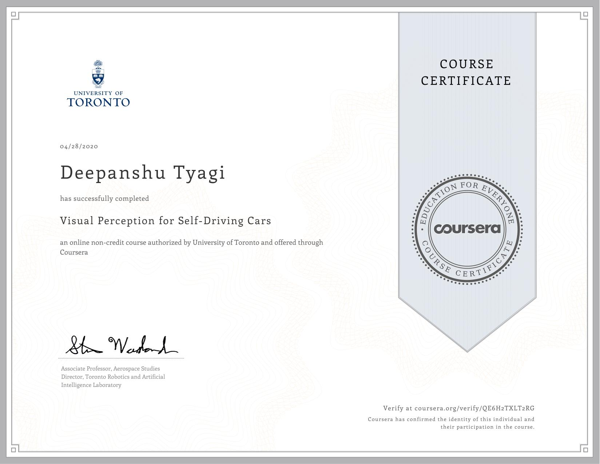

# Visual Perception for Self-Driving Cars

This course will introduce you to the main perception tasks in autonomous driving, static and dynamic object detection, and will survey common computer vision methods for robotic perception. By the end of this course, you will be able to work with the pinhole camera model, perform intrinsic and extrinsic camera calibration, detect, describe and match image features and design your own convolutional neural networks. You'll apply these methods to visual odometry, object detection and tracking, and semantic segmentation for drivable surface estimation. These techniques represent the main building blocks of the perception system for self-driving cars. For the final project in this course, you will develop algorithms that identify bounding boxes for objects in the scene, and define the boundaries of the drivable surface.

## Week 1: Basics of 3D Computer Vision

This module introduces the main concepts from the broad field of computer vision needed to progress through perception methods for self-driving vehicles. The main components include camera models and their calibration, monocular and stereo vision, projective geometry, and convolution operations.

- Module 1: [Graded Quiz](./Week_1/Module_1_Graded_Quiz.pdf)

## Week 2: Visual Features - Detection, Description and Matching

Visual features are used to track motion through an environment and to recognize places in a map. This module describes how features can be detected and tracked through a sequence of images and fused with other sources for localization as described in Course 2. Feature extraction is also fundamental to object detection and semantic segmentation in deep networks, and this module introduces some of the feature detection methods employed in that context as well.

- Programming Assignment: [Visual Odometry for Localization in Autonomous Driving](./Week_2/visual_odometry_for_localization_in_autonomous_driving.ipynb)
  - Submission Files [output.yaml](./Week_2/output.yaml)

## Week 3: Feedforward Neural Networks

Deep learning is a core enabling technology for self-driving perception. This module briefly introduces the core concepts employed in modern convolutional neural networks, with an emphasis on methods that have been proven to be effective for tasks such as object detection and semantic segmentation. Basic network architectures, common components and helpful tools for constructing and training networks are described.

- Module 3: [Graded Quiz](./Week_3/Module_3_Graded_Quiz.pdf)

## Week 4: 2D Object Detection

The two most prevalent applications of deep neural networks to self-driving are object detection, including pedestrian, cyclists and vehicles, and semantic segmentation, which associates image pixels with useful labels such as sign, light, curb, road, vehicle etc. This module presents baseline techniques for object detection and the following module introduce semantic segmentation, both of which can be used to create a complete self-driving car perception pipeline.

- Module 4: [Graded Quiz](./Week_4/Module_4_Graded_Quiz.pdf)

## Week 5: Semantic Segmentation

The second most prevalent application of deep neural networks to self-driving is semantic segmentation, which associates image pixels with useful labels such as sign, light, curb, road, vehicle etc. The main use for segmentation is to identify the drivable surface, which aids in ground plane estimation, object detection and lane boundary assessment. Segmentation labels are also being directly integrated into object detection as pixel masks, for static objects such as signs, lights and lanes, and moving objects such cars, trucks, bicycles and pedestrians.

- Module 5: [Graded Quiz](./Week_5/Module_5_Graded_Quiz.pdf)

## Week 6: Perception of dynamic objects in the drivable region

The final module of this course focuses on the implementation of a collision warning system that alerts a self-driving car about the position and category of obstacles present in their lane. The project is comprised of three major segments: 1) Estimating the drivable space in 3D, 2) Semantic Lane Estimation and 3) Filter wrong output from object detection using semantic segmentation.

- Final Project: [Environment Perception For Self-Driving Cars](./Week_6/final_project)
  - Submission Files [output.yaml](./Week_6/output.yaml)

## Course Certificate

