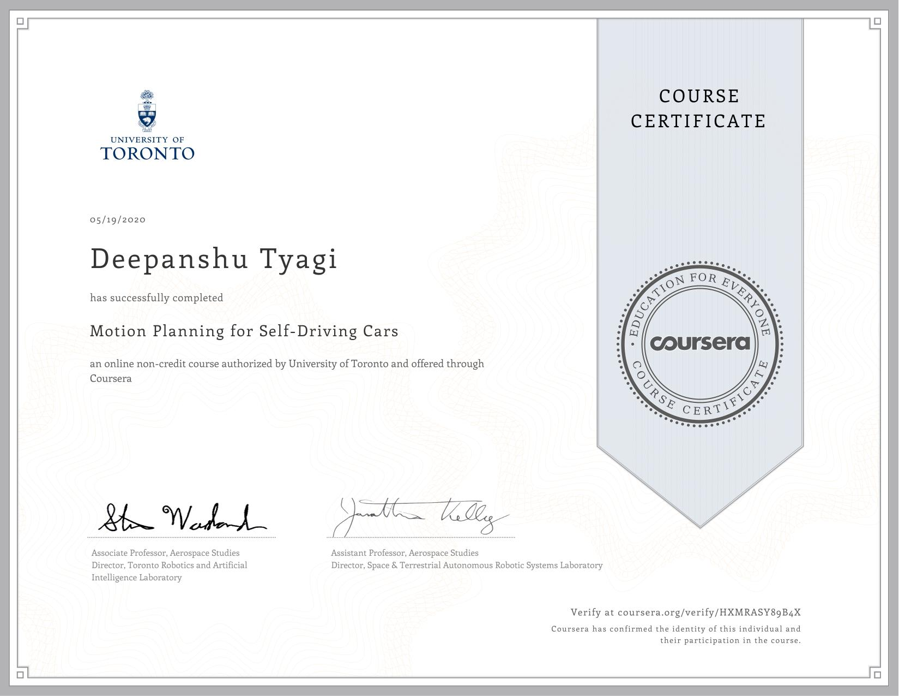

# Motion Planning for Self-Driving Cars

This course will introduce you to the main planning tasks in autonomous driving, including mission planning, behavior planning and local planning. By the end of this course, you will be able to find the shortest path over a graph or road network using Dijkstra's and the A* algorithm, use finite state machines to select safe behaviors to execute, and design optimal, smooth paths and velocity profiles to navigate safely around obstacles while obeying traffic laws. You'll also build occupancy grid maps of static elements in the environment and learn how to use them for efficient collision checking. This course will give you the ability to construct a full self-driving planning solution, to take you from home to work while behaving like a typical driving and keeping the vehicle safe at all times. For the final project in this course, you will implement a hierarchical motion planner to navigate through a sequence of scenarios in the CARLA simulator, including avoiding a vehicle parked in your lane, following a lead vehicle and safely navigating an intersection.

## Week 1: The Planning Problem

This module introduces the richness and challenges of the self-driving motion planning problem, demonstrating a working example that will be built toward throughout this course. The focus will be on defining the primary scenarios encountered in driving, types of loss functions and constraints that affect planning, as well as a common decomposition of the planning problem into behaviour and trajectory planning subproblems. This module introduces a generic, hierarchical motion planning optimization formulation that is further expanded and implemented throughout the subsequent modules.

- Module 1: [Graded Quiz](./Week_1/Module_1_Graded_Quiz.pdf)

## Week 2: Mapping for Planning

The occupancy grid is a discretization of space into fixed-sized cells, each of which contains a probability that it is occupied. It is a basic data structure used throughout robotics and an alternative to storing full point clouds. This module introduces the occupancy grid and reviews the space and computation requirements of the data structure. In many cases, a 2D occupancy grid is sufficient; learners will examine ways to efficiently compress and filter 3D LIDAR scans to form 2D maps.

- Programming Assignment: [Occupancy Grid Generation](./Week_2/Module_2_Assessment.ipynb)
  - Submission Files [occ_grid_values.txt](./Week_2/occ_grid_values.txt)

## Week 3: Mission Planning in Driving Environments

This module develops the concepts of shortest path search on graphs in order to find a sequence of road segments in a driving map that will navigate a vehicle from a current location to a destination. The modules covers the definition of a roadmap graph with road segments, intersections and travel times, and presents Dijkstra’s and A* search for identification of the shortest path across the road network.

- Module 3: [Graded Quiz](./Week_3/Module_3_Graded_Quiz.pdf)

## Week 4: Dynamic Object Interactions

This module introduces dynamic obstacles into the behaviour planning problem, and presents learners with the tools to assess the time to collision of vehicles and pedestrians in the environment.

- Module 4: [Graded Quiz](./Week_4/Module_4_Graded_Quiz.pdf)

## Week 5: Principles of Behaviour Planning

This module develops a basic rule-based behaviour planning system, which performs high level decision making of driving behaviours such as lane changes, passing of parked cars and progress through intersections. The module defines a consistent set of rules that are evaluated to select preferred vehicle behaviours that restrict the set of possible paths and speed profiles to be explored in lower level planning.

- Module 5: [Graded Quiz](./Week_5/Module_5_Graded_Quiz.pdf)

## Week 6: Reactive Planning in Static Environments

A reactive planner takes local information available within a sensor footprint and a global objective defined in a map coordinate frame to identify a locally feasible path to follow that is collision free and makes progress to a goal. In this module, learners will develop a trajectory rollout and dynamic window planner, which enables path finding in arbitrary static 2D environments. The limits of the approach for true self-driving will also be discussed.

- Module 6: [Graded Quiz](./Week_6/Module_6_Graded_Quiz.pdf)

## Week 7: Smooth Local Planning

Parameterized curves are widely used to define paths through the environment for self-driving. This module introduces continuous curve path optimization as a two point boundary value problem which minimized deviation from a desired path while satisfying curvature constraints.

- Final Project: [Self-Driving Vehicle Control](./Week_7/final_project)
  - Submission Files [trajectory.txt](./Week_7/trajectory.txt)
  - Submission Files [collision_count.txt](./Week_7/collision_count.txt)
  - Project Video: [Link](./media/video.mp4)

## Course Certificate

