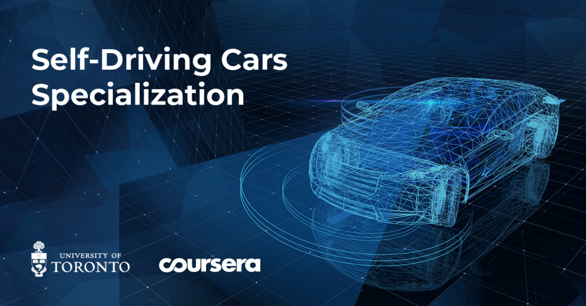
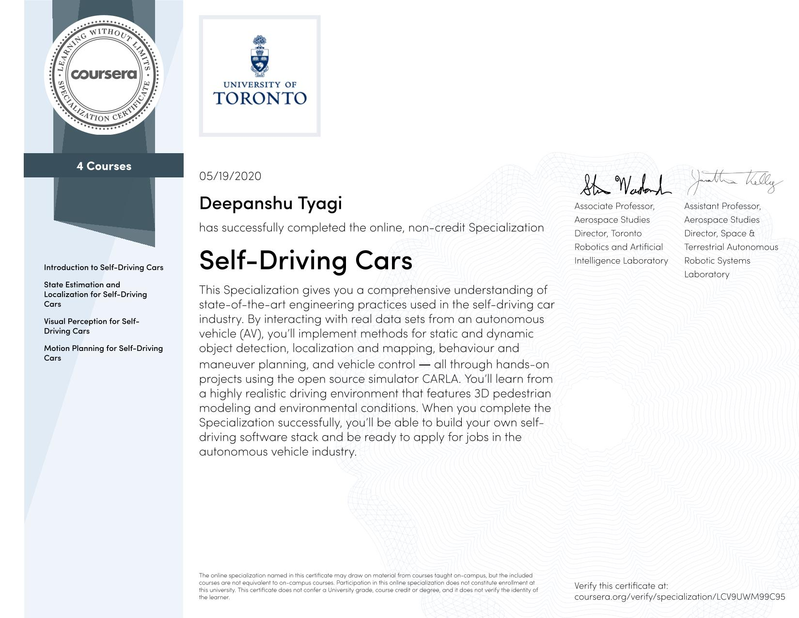

# Self-Driving Cars Specialization

## Content

- [Introduction to Self-Driving Cars](./01_introduction_to_self_driving_cars)
- [State Estimation and Localization for Self-Driving Cars](./02_state_estimation_and_localization)
- [Visual Perception for Self-Driving Cars](./03_visual_perception)
- [Motion Planning for Self-Driving Cars](./04_motion_planning)

## Objective

- Understand the detailed architecture and components of a self-driving car software stack.
- Implement methods for static and dynamic object detection, localization and mapping, behavior and maneuver planning, and vehicle control.
- Use realistic vehicle physics, complete sensor suite: camera, LIDAR, GPS/INS, wheel odometry, depth map, semantic segmentation, object bounding boxes.
- Demonstrate skills in CARLA and build programs with Python.

## Certificate

